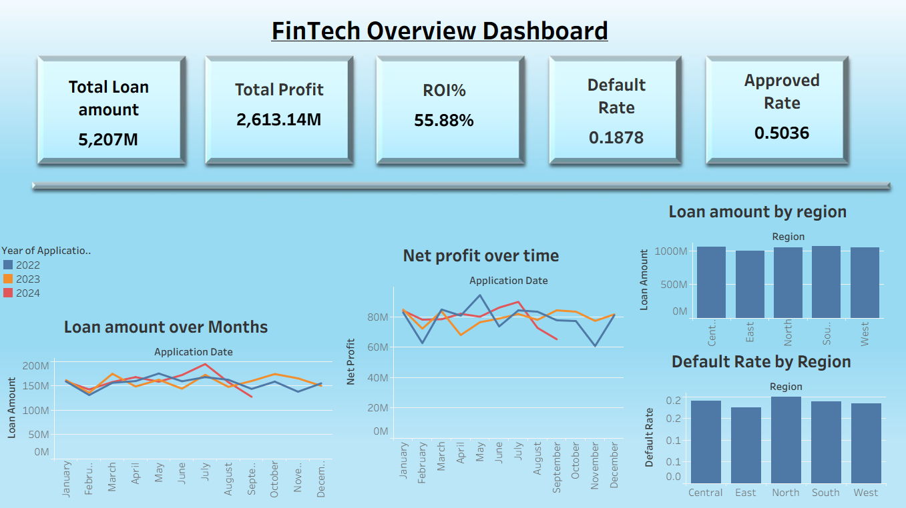

# FinTech Loan Portfolio Dashboard

## Project Overview

The **FinTech Loan Portfolio Dashboard** is a comprehensive Tableau project designed to analyze and visualize the performance of a digital lending business. This dashboard provides a unified view of loan disbursements, repayments, ROI, and defaults across various regions, channels, and customer segments.

The dataset comprises **10,000+ records** and multiple attributes, providing valuable insights into key financial and risk metrics such as disbursed amount, repayment performance, interest income, and customer score distribution.

The primary objective of this project is to **enable data-driven lending decisions** and monitor portfolio profitability and risk exposure through interactive visual analytics.

---

##  Dataset Description

The dataset contains **10,000 rows** and **13 columns**, representing loan-level data from a digital lending platform.

**Key Columns:**

* Loan_ID — Unique identifier for each loan
* Application_Date — Loan disbursement date
* Region — North, South, East, West, Central
* Channel — Mobile App, Website, Partner, Branch
* Loan_Amount — Requested or approved loan amount
* Disbursed_Amount — Actual amount disbursed
* Repayment_Amount — Amount repaid (principal + interest)
* Default_Amount — Amount not recovered (Disbursed – Repaid)
* Tenure_Months — Loan tenure in months
* Interest_Rate — Annual interest rate applied
* Customer_Score — Internal credit score (300–900)
* Loan_Status — Paid, Defaulted, Rejected, Approved

---

## Key Insights and Metrics
The dashboard highlights several critical financial performance indicators, including:

* **Total Loan Amount:** ₹5,204M
* **Total Net Profit:** 2613.14m
* **Portfolio ROI:** 55.88%
* **Default Rate:** 0.5036M

## Tools and Technologies Used

* **Tableau Public**
* **Microsoft Excel**

## Dashboard Components
1. **Portfolio Overview:** KPIs and trend charts
2. **Risk & Score Analysis:** Default amount vs credit score and score distribution
3. **Channel Insights:** Channel-wise ROI, loan volume, and default ratio
4. **Regional Map View:** Geographic visualization of portfolio risk
5. **Customer Demographics:** Age and income-based loan segmentation

## 🖼️ Dashboard Preview
## 🖼️ Dashboard Preview
Dashboard Overview

